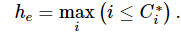
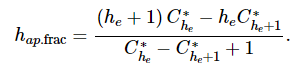
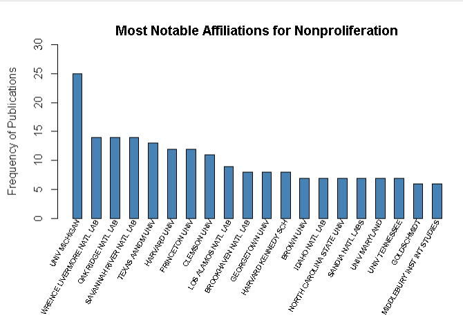
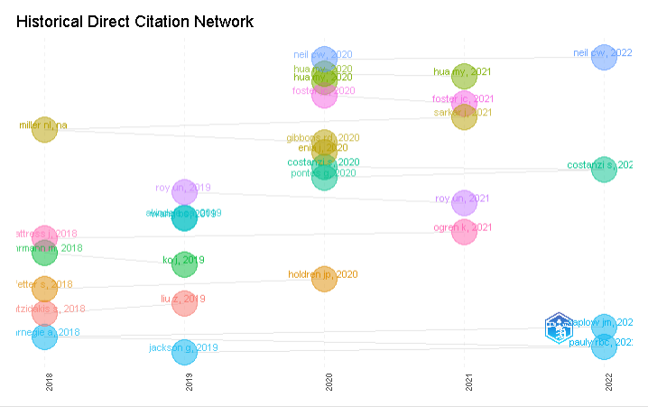
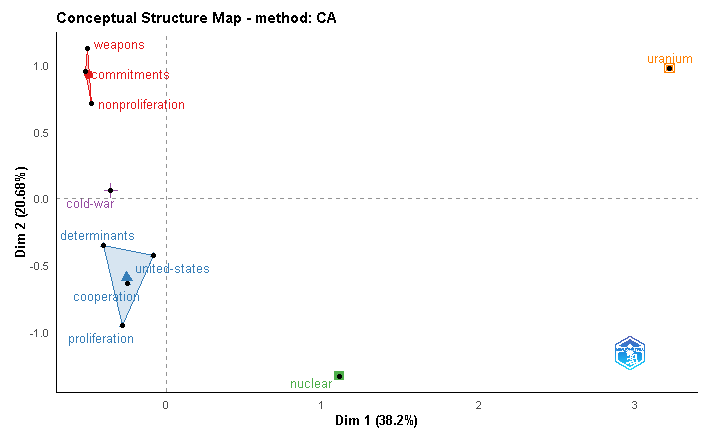
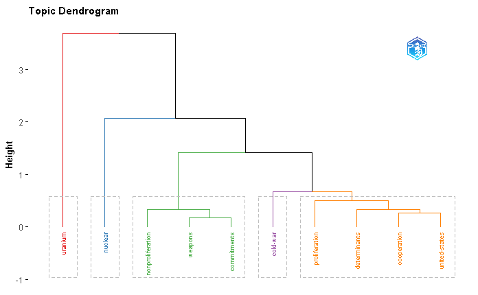
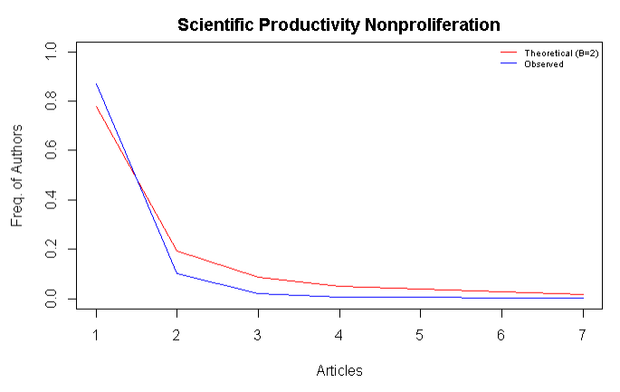
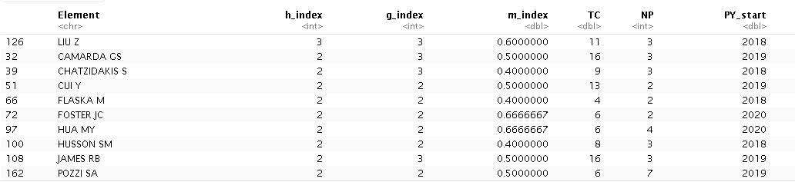
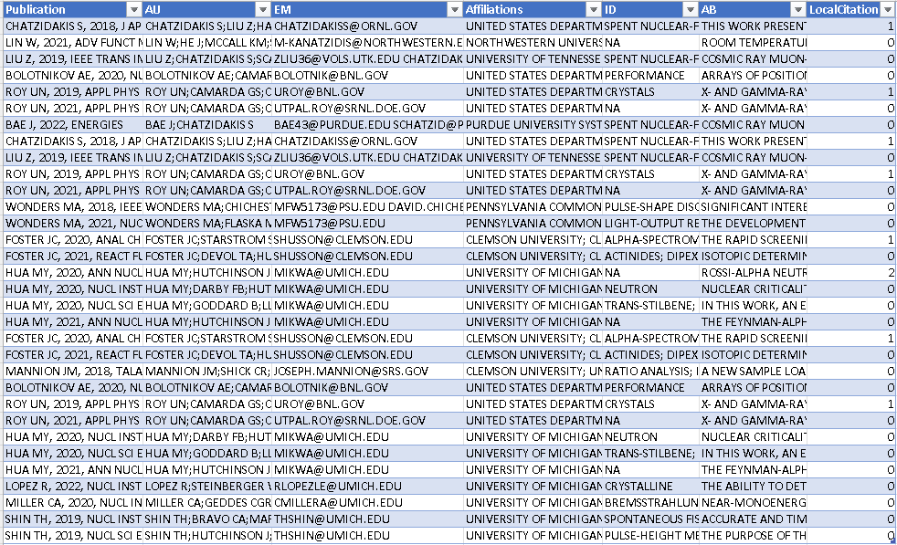

# Network Analysis of Scientific Publications - BZAN 542
Authors: Daniel Riddick, Christopher Morton, & Stephen Muszik
Summary/Overview
This project is an example of using R (and possibly R shiny) to Analyze scientific publications and create a user interface that assists in finding impactful authors and their affiliations within a subject area. This project was done for BZAN 542 final project.

The data used for this project came from the webofscience. https://www.webofscience.com/wos/woscc/basic-search From the website you can only obtain 500 publications at a time in a Bibtex format. For this reason we limited this initial proof of concept to four specific subject areas: Explosives Engineering, Non Proliferation, Nuclear Engineering, and Theoretical Physics.

## Contacts

- [Daniel Riddick](mailto:danwridd@vols.utk.edu)
- [Stephen Muszik](mailto:smuszik@vols.utk.edu)
- [Chris Morton](mailto:cmorto11@vols.utk.edu)

## Cleaning the Data

The data that was used for this project came from the Web of Science. From this database the user is restricted to only extracting 500 records at a time. Because of this constraint, we limited this proof of concept to a small sample of publications from 4 different subject areas: Explosives Engineering, Nonproliferation, Nuclear Engineering, and Theoretical Physics. We also limited the data set to exclude multiple country publications, publications that were 5 years or older, journal articles only, and the English language only. 

When obtaining the data from the Web of Science, they only provided an option of data in Bibtex format in order to include references. Due to this, each time we extracted data from the database, we had to convert the data into a csv file. Once the file was converted to a csv, we used R to remove redundant, outdated, and trivial information that was not needed from the data in order to improve processing time. The columns that were identified as ROT were ‘BO’, ‘earlyaccessdate’, ‘BE’, ‘eissn’, ‘BN’, ‘FX’, ‘organization’, ‘PP’, ‘researcherid.numbers’, ‘SE’, and ‘AU_UN_NR. Once this was achieved, we were able to do analysis on the data using the Bibliometrix library.

## Methods Used

In order to perform our analysis on our publication data we used a variety of tools. Firstly we used R as our main language for association analysis and H-index calculation. The H-index we used is known as an adapted H-index. What the H-index measures is the productivity and citation impact of a publication. We decided to use an adapted H-index which gives a different score for citations by dividing the citation count by the square-root of the number of authors.

What this does is remove the problem with giving higher scores to publications simply because they have more citations. This has become an issue because of a new method to writing publications. This method includes using more citations than publications have in the past. Because of this, some publications are getting a higher score simply because of the number of citations they have rather than on its productivity. After calculating the new citation counts, the h-equivalent value was calculated using the maximum rank for which the rank is less than or equal to the citation count.

From this, we finally calculated the H-index using this formula:

For our association analysis, we used a library in R called Bibliometrix. This R package “provides a set of tools for quantitative research in bibliometrics and scientometrics.” This evaluation of publication data, Including their citations, is used in almost every field of science to evaluate the growth of their scientific community conceptually. This package comes with functions biblioAnalysis to perform basic descriptive analysis, options to summarize statistical analysis, citations to obtain the most frequently cited publications, dominance to obtain the highest scoring authors, histNetwork along with histPlot to obtain a historical local citations network analysis, and Hindex to calculate a standard Hindex rating, and many more. Along with the Bibliometrix package, we also used tidyverse for visualizations along with the plot functions that were provided by Bibliometrix. 

K-means clustering places all observations into k number of clusters, with each one being assigned to the cluster who’s mean (or centroid) has the shortest distance. In this instance, each publication serves as an observation, and the clusters in which they are organized represent the keywords that those articles contain.

We utilized Lotka’s Law Coefficient Estimation, which describes the frequency of publication by authors in any given field as an inverse square law, where the number of authors publishing a certain number of articles is a fixed ratio to the number of authors publishing a single article. This assumption implies that the theoretical beta coefficient of Lotka’s law is equal to 2. In layman’s terms, Lotka’s Law essentially measures the expected frequency of authors and their number of publications vs. the observed frequency of authors and their number of publications. It is a good measure for observing overall bias within the data.

We took a sample of 100 publications for each subject area, then conducted a 95% confidence test for true on-target publications for specific publication areas. The number of successes represent instances where the model accurately predicted the subject area for each publication, and the number of failures represent instances where the publication discussed irrelevant subject matter.

## Results

During the analysis, we were able to determine detailed information regarding the most prolific organizations and authors related to each subject area of interest. Below, we have included output related to one subject area of interest, Nonproliferation, in order to showcase some of the output for this project.
Figure 1, shows the frequency of affiliations within each of these publications. By utilizing the biblioanalysis function inside the bibliometrix package, affiliations frequencies were generated for each subject area. This bar plot shows the top 20 affiliations associated with Nonproliferation in specific. This output allows the end user to be able to see which organizations would be ideal to contact in relation to Nonproliferation for future partnerships.

Figure 1

In order to gauge the relative novelty of each publication, a historical local citation network was built. This can be seen below in figure 2. By looking into the network and understanding how over time authors are citing one another inside this data, the end user can begin to gauge which authors are producing the most novel and prolific publications. The local citation counts were also recorded within the final table output for consideration of the end user.

Figure 2

Additionally, the topics with each of the publications were mapped using K-means clustering with correspondence analysis. This end result allows the user to see typical topics and how they are related to each other within each subject area. Figures 3 and 4 both show output forNonproliferation regarding the aforementioned usage.

Figure 3

Figure 4

Utilizing Lotka’s Law, the user is able to understand expected scientific productivity versus the observed scientific productivity within the data. This output is being used as a form of data validation, ensuring that publications are not outside the bounds of the theoretical beta coefficient. None of the subject areas fell drastically outside the bounds of the theoretical beta coefficient within the analysis. This indicates that scientific productivity appears to be normalized within the data that was utilized within this analysis. Figure 5 shows the results of the theoretical beta coefficient versus the observed scientific productivity.

Figure 5

The final output of the analysis was within a table format, listing the authors of interest based on the adapted pure H-index value that was calculated. The authors were ordered and restricted to showing the top 10 highest values for the adapted pure H-index. Figure 6 shows the results of this output. The results from Figure 6 were then used to find the publications tied to each of the top 10 authors. This new table output in Figure 7 allows for the final output with respect to the determination of authors of interest related to specific subject areas. The table in Figure 7 shows the publication title, associated authors, email addresses, publication affiliation, keywords about the publications, an abstract for each publication, and the amount of local citations for each publication. The end user with this output is then able to determine which publication and the associated authors are of the most interest to network with in the future.

Figure 6

Figure 7

## Conclusion

The purpose of this project was to determine future partnership opportunities in specific subject areas of interest by utilizing publication data from the Web of Science. Within this project, output was produced that successfully allows the end user to be able to determine which organizations and individuals are of high interest related to a subject area. 
Sources

## Sources
https://www.bibliometrix.org/vignettes/Introduction_to_bibliometrix.html
[https://www.webofscience.com/wos/woscc/basic-search]
(https://www.webofscience.com/wos/woscc/basic-search)
https://www.rosenberglab.net/impact_adapt_pure_h_index_frac.html
https://images.webofknowledge.com/images/help/WOS/hs_wos_fieldtags.html

